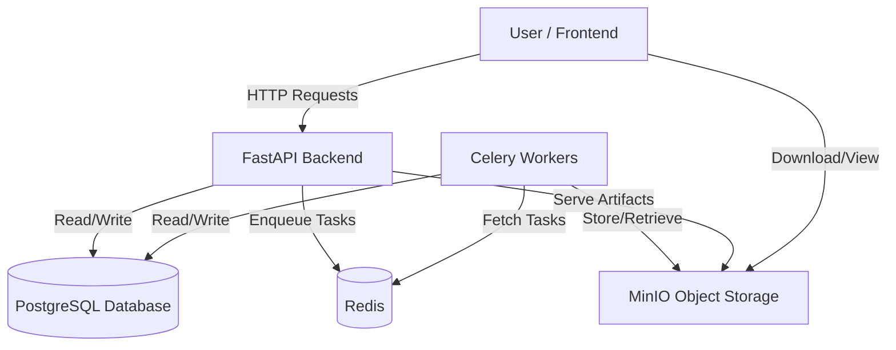

# Universal Analyst Model (UAM) Backend - High-Level Data Flow Diagram

This document provides a high-level data flow diagram illustrating the main components of the UAM backend platform and how data flows between them.

## Components

- **User / Frontend:** The client interface where users interact with the platform.
- **FastAPI Backend:** The REST API server handling requests and coordinating operations.
- **PostgreSQL Database:** Stores structured data such as users, projects, datasets metadata, runs, and models.
- **Redis & Celery Workers:** Handle asynchronous background tasks like data processing and model training.
- **MinIO Object Storage:** Stores datasets, model artifacts, and analysis outputs.

## Data Flow Diagram (Mermaid)

## Description

1. The user interacts with the frontend, which sends HTTP requests to the FastAPI backend.
2. The backend processes requests, performing CRUD operations on the PostgreSQL database.
3. For long-running or resource-intensive tasks, the backend enqueues jobs into Redis.
4. Celery workers fetch tasks from Redis and perform data processing, model training, or analysis.
5. Workers read from and write to the database as needed during task execution.
6. Workers store large files, datasets, and model artifacts in MinIO object storage.
7. The backend serves stored artifacts to users via API endpoints.
8. Users can download or view datasets, models, and analysis results from the storage through the frontend.

This architecture ensures scalability, responsiveness, and efficient handling of data-intensive operations.
